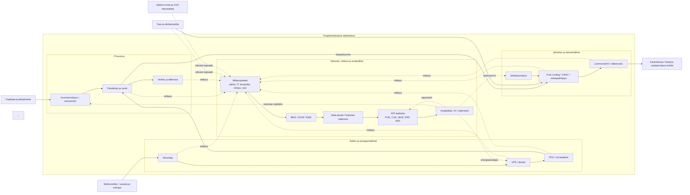

```mermaid
flowchart LR
    USERS["Kayttajat ja pilvipalvelut"]
    WEATHER["Saa ja ulkolampotila"]
    PRICE["Sahkon hinta ja CO2-intensiteetti"]
    GRID["Sahkoverkko / uusiutuva energia"]
    HEATNET["Kaukolampo / lampoa vastaanottava kohde"]

    subgraph DC["Ymparistokestava datakeskus"]
        direction LR

        subgraph POWER["Sahko ja energianhallinta"]
            TR["Muuntaja"]
            UPS["UPS / akusto"]
            PDU["PDU / virranjakelu"]
        end

        subgraph IT["IT-kuorma"]
            ORCH["Kuormanohjaus / orkestrointi"]
            RACKS["Palvelimet ja rackit"]
            NET["Verkko ja tallennus"]
        end

        subgraph COOL["Jahdytys ja lampohallinta"]
            COOLCTRL["Jahdytysohjaus"]
            COOLSYS["Free cooling / CRAC / nestejaahdytys"]
            HX["Lammonsiirrin / talteenotto"]
        end

        subgraph DATA["Valvonta, mittaus ja analytiikka"]
            SENSORS["Mittauspisteet<br/>sahko, IT, lampotila, virtaus, vesi"]
            BMS["BMS / DCIM / EMS"]
            STORE["Data-alusta / historian tallennus"]
            KPI["KPI-laskenta<br/>PUE, CUE, WUE, ERF, REF"]
            OPT["Analytiikka / AI / optimointi"]
        end
    end

    GRID --> TR --> UPS --> PDU --> RACKS
    USERS --> ORCH --> RACKS
    RACKS --> NET
    RACKS -->|lampokuorma| COOLSYS
    WEATHER --> COOLSYS
    COOLCTRL --> COOLSYS
    COOLSYS --> HX --> HEATNET

    TR -.->|mittaus| SENSORS
    UPS -.->|mittaus| SENSORS
    PDU -.->|mittaus| SENSORS
    RACKS -.->|mittaus| SENSORS
    NET -.->|mittaus| SENSORS
    COOLSYS -.->|mittaus| SENSORS
    HX -.->|mittaus| SENSORS
    WEATHER -.->|ulkoiset signaalit| SENSORS
    PRICE -.->|ulkoiset signaalit| SENSORS

    SENSORS --> BMS --> STORE --> KPI --> OPT

    OPT -.->|asetusarvot| COOLCTRL
    OPT -.->|kuorman sijoittelu| ORCH
    OPT -.->|energiastrategia| UPS
    OPT -.->|raportointi| KPI


...
```
