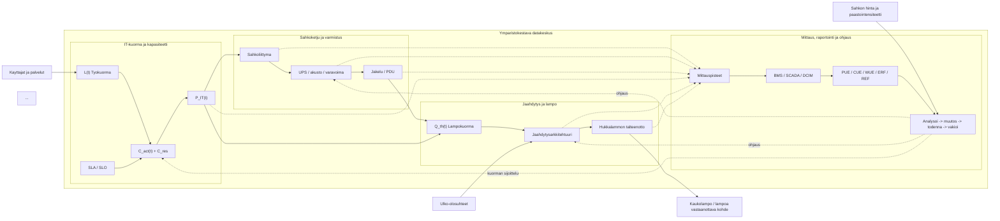

```mermaid
flowchart LR
    USERS["Kayttajat ja palvelut"]
    WEATHER["Ulko-olosuhteet"]
    PRICE["Sahkon hinta ja paastointensiteetti"]
    HEATNET["Kaukolampo / lampoa vastaanottava kohde"]

    subgraph DC["Ymparistokestava datakeskus"]
        direction LR

        subgraph IT["IT-kuorma ja kapasiteetti"]
            WORKLOAD["L(t) Tyokuorma"]
            SLA["SLA / SLO"]
            CAP["C_act(t) + C_res"]
            PIT["P_IT(t)"]
        end

        subgraph POWER["Sahkoketju ja varmistus"]
            GRID["Sahkoliittyma"]
            UPS["UPS / akusto / varavoima"]
            DIST["Jakelu / PDU"]
        end

        subgraph COOL["Jaahdytys ja lampo"]
            QTH["Q_th(t) Lampokuorma"]
            COOLSYS["Jaahdytysarkkitehtuuri"]
            HX["Hukkalammon talteenotto"]
        end

        subgraph DATA["Mittaus, raportointi ja ohjaus"]
            METERS["Mittauspisteet"]
            BMS["BMS / SCADA / DCIM"]
            KPI["PUE / CUE / WUE / ERF / REF"]
            OPT["Analysoi -> muutos -> todenna -> vakioi"]
        end
    end

    USERS --> WORKLOAD
    WORKLOAD --> CAP
    SLA --> CAP
    CAP --> PIT

    PIT --> GRID
    GRID --> UPS --> DIST
    DIST --> QTH
    PIT --> QTH

    QTH --> COOLSYS --> HX --> HEATNET
    WEATHER --> COOLSYS
    PRICE --> OPT

    GRID -.-> METERS
    UPS -.-> METERS
    DIST -.-> METERS
    PIT -.-> METERS
    COOLSYS -.-> METERS
    HX -.-> METERS

    METERS --> BMS --> KPI --> OPT
    OPT -. ohjaus .-> UPS
    OPT -. ohjaus .-> COOLSYS
    OPT -. kuorman sijoittelu .-> CAP

...
```

