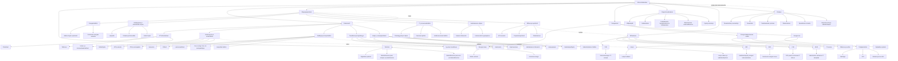

# Kasitekartta - vihrea datakeskus

```mermaid
flowchart TB
    GDC["Vihrea datakeskus"]

    GDC --> T["Tarkoitus"]
    GDC --> E["Paelementit"]
    GDC --> C["Ohjausjarjestelmat"]
    GDC --> EN["Energiavirrat"]
    GDC --> I["Ymparistovaikutukset"]
    GDC --> M["Mittaaminen"]
    GDC --> L["Elinkaari"]

    T --> T1["Digitaaliset palvelut"]
    T --> T2["Mahdollisimman pieni energia- ja paastokuorma"]
    T --> T3["Mahdollisimman pieni vesi- ja materiaalikuorma"]

    E --> E1["ICT-infrastruktuuri"]
    E --> E2["Sahkonsyotto ja virranhallinta"]
    E --> E3["Jaahdytys ja lampohallinta"]
    E --> E4["Turvallisuus ja kaytettavyys"]
    E --> E5["Lampo- ja vesijarjestelmat"]

    E1 --> E1a["Palvelimet"]
    E1 --> E1b["Tallennus"]
    E1 --> E1c["Verkko- ja kommunikaatiolaitteet"]

    E2 --> E2a["Sahkoliitynta"]
    E2 --> E2b["UPS ja akusto"]
    E2 --> E2c["PDU ja virranjakelu"]
    E2 --> E2d["Varavoima"]

    E3 --> E3a["Chillerit"]
    E3 --> E3b["Lammonvaihtimet"]
    E3 --> E3c["Free cooling / ilma- tai nestejaahdytys"]
    E3 --> E3d["Lampotilan hallinta"]

    E4 --> E4a["Fyysinen turvallisuus"]
    E4 --> E4b["Hairionsieto"]
    E4 --> E4c["Kayttovarmuus"]

    E5 --> E5a["Hukkalammon talteenotto"]
    E5 --> E5b["Lampopumput"]
    E5 --> E5c["Kaukolampoliitynta"]
    E5 --> E5d["Vedenkulutuksen hallinta"]

    C --> C1["Energianhallinta"]
    C --> C2["Jaahdytyksen ja olosuhteiden ohjaus"]
    C --> C3["IT- ja kuormanhallinta"]
    C --> C4["Hukkalammon ohjaus"]
    C --> C5["Mittaus ja raportointi"]

    C1 --> C1a["Sahkon kayton optimointi"]
    C1 --> C1b["Uusiutuvan energian seuranta"]

    C2 --> C2a["Lampotila"]
    C2 --> C2b["Virtaama ja ilmanvaihto"]
    C2 --> C2c["Veden kaytto"]

    C3 --> C3a["Palvelupyyntojen ohjaus"]
    C3 --> C3b["Kuorman sijoittelu"]
    C3 --> C3c["Verkkoresurssien hallinta"]

    C4 --> C4a["Lammon talteenotto"]
    C4 --> C4b["Lammonsiirto hyotykayttoon"]

    C5 --> C5a["KPI-seuranta"]
    C5 --> C5b["Ymparistoraportointi"]
    C5 --> C5c["Todentaminen"]

    EN --> EN1["Energia sisaan"]
    EN --> EN2["Energia datakeskuksen sisalla"]
    EN --> EN3["Energia ulos"]

    EN1 --> EN1a["Sahko verkosta"]
    EN1 --> EN1b["Uusiutuva energia"]

    EN2 --> EN2a["IT-kuorma"]
    EN2 --> EN2b["Tallennus ja verkko"]
    EN2 --> EN2c["Tukijarjestelmat"]
    EN2c --> EN2c1["Jaahdytys"]
    EN2c --> EN2c2["UPS"]
    EN2c --> EN2c3["Valaistus ja muu infra"]

    EN3 --> EN3a["Digitaalinen palvelu"]
    EN3 --> EN3b["Lampo"]
    EN3b --> EN3b1["Lampo hukkaan"]
    EN3b --> EN3b2["Lampo talteen ja uudelleenkayttoon"]

    I --> I1["Hiilijalanjalki"]
    I --> I2["Vedenkulutus"]
    I --> I3["Hukkalammön hyodyntaminen tai hukkaaminen"]
    I --> I4["Rakentamisen materiaalikuorma"]
    I --> I5["E-jate ja kierratys"]

    M --> M1["PUE"]
    M --> M2["ERF"]
    M --> M3["REF"]
    M --> M4["CUE"]
    M --> M5["WUE"]

    M1 --> M1a["Kokonaisenergia / IT-energia"]
    M2 --> M2a["Uudelleenkaytetty energia / kokonaiskulutus"]
    M3 --> M3a["Uusiutuvan energian osuus"]
    M4 --> M4a["CO2-paastot suhteessa IT-tehoon"]
    M5 --> M5a["Vedenkulutus suhteessa IT-energiaan"]

    L --> L1["Tarvekartoitus ja esiselvitys"]
    L --> L2["Suunnittelu"]
    L --> L3["Paatoksenteko ja luvitus"]
    L --> L4["Rakentaminen"]
    L --> L5["Operatiivinen toiminta"]
    L --> L6["Kaytosta poisto ja uudelleenkaytto"]

    E2 -. tukee .-> EN1
    E3 -. hallitsee .-> EN3b
    C -. ohjaa .-> E
    C5 -. tuottaa .-> M
    M -. todentaa .-> T
    L -. koskee koko kokonaisuutta .-> GDC
```
