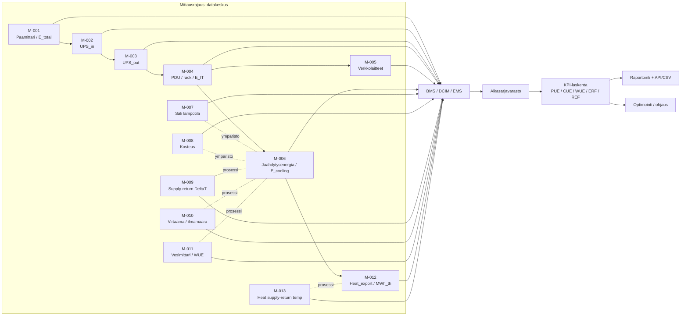

```mermaid
flowchart LR
    subgraph BOUNDARY["Mittausrajaus: datakeskus"]
        direction LR

        GRID["M-001<br/>Paamittari / E_total"]
        UPSIN["M-002<br/>UPS_in"]
        UPSOUT["M-003<br/>UPS_out"]
        PDU["M-004<br/>PDU / rack / E_IT"]
        NET["M-005<br/>Verkkolaitteet"]
        COOLPWR["M-006<br/>Jaahdytysenergia / E_cooling"]
        TEMP["M-007<br/>Sali lampotila"]
        RH["M-008<br/>Kosteus"]
        DT["M-009<br/>Supply-return DeltaT"]
        FLOW["M-010<br/>Virtaama / ilmamaara"]
        WATER["M-011<br/>Vesimittari / WUE"]
        HEAT["M-012<br/>Heat_export / MWh_th"]
        HEATTEMP["M-013<br/>Heat supply-return temp"]
    end

    GRID --> UPSIN --> UPSOUT --> PDU
    PDU --> NET
    PDU --> COOLPWR
    COOLPWR --> HEAT

    TEMP -. ymparisto .- COOLPWR
    RH -. ymparisto .- COOLPWR
    DT -. prosessi .- COOLPWR
    FLOW -. prosessi .- COOLPWR
    WATER -. prosessi .- COOLPWR
    HEATTEMP -. prosessi .- HEAT

    GRID --> BMS["BMS / DCIM / EMS"]
    UPSIN --> BMS
    UPSOUT --> BMS
    PDU --> BMS
    NET --> BMS
    COOLPWR --> BMS
    TEMP --> BMS
    RH --> BMS
    DT --> BMS
    FLOW --> BMS
    WATER --> BMS
    HEAT --> BMS
    HEATTEMP --> BMS

    BMS --> TS["Aikasarjavarasto"]
    TS --> KPI["KPI-laskenta<br/>PUE / CUE / WUE / ERF / REF"]
    KPI --> RPT["Raportointi + API/CSV"]
    KPI --> OPT["Optimointi / ohjaus"]
```
