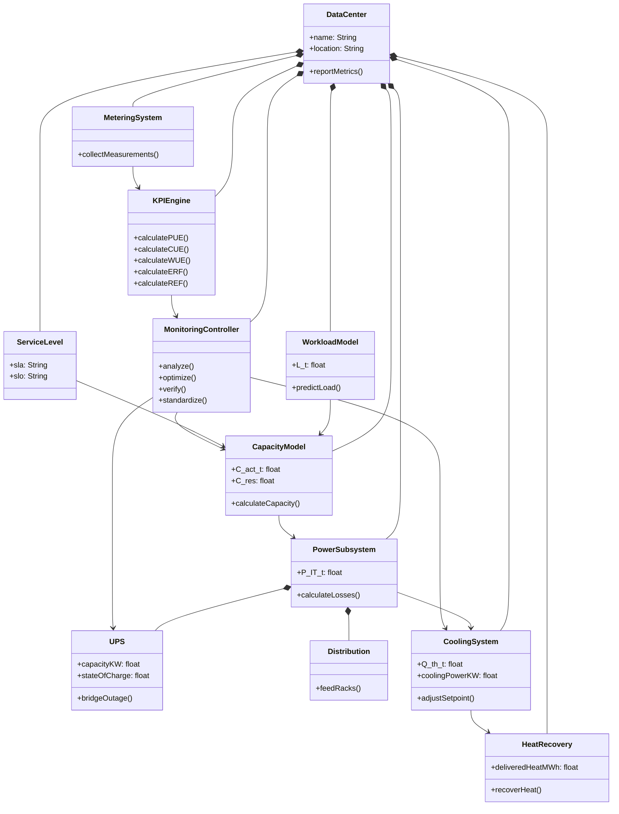

```mermaid
classDiagram
    class DataCenter {
      +name: String
      +location: String
      +reportMetrics()
    }

    class WorkloadModel {
      +L_t: float
      +predictLoad()
    }

    class ServiceLevel {
      +sla: String
      +slo: String
    }

    class CapacityModel {
      +C_act_t: float
      +C_res: float
      +calculateCapacity()
    }

    class PowerSubsystem {
      +P_IT_t: float
      +calculateLosses()
    }

    class UPS {
      +capacityKW: float
      +stateOfCharge: float
      +bridgeOutage()
    }

    class Distribution {
      +feedRacks()
    }

    class CoolingSystem {
      +Q_th_t: float
      +coolingPowerKW: float
      +adjustSetpoint()
    }

    class HeatRecovery {
      +deliveredHeatMWh: float
      +recoverHeat()
    }

    class MeteringSystem {
      +collectMeasurements()
    }

    class KPIEngine {
      +calculatePUE()
      +calculateCUE()
      +calculateWUE()
      +calculateERF()
      +calculateREF()
    }

    class MonitoringController {
      +analyze()
      +optimize()
      +verify()
      +standardize()
    }

    DataCenter *-- WorkloadModel
    DataCenter *-- ServiceLevel
    DataCenter *-- CapacityModel
    DataCenter *-- PowerSubsystem
    DataCenter *-- CoolingSystem
    DataCenter *-- HeatRecovery
    DataCenter *-- MeteringSystem
    DataCenter *-- KPIEngine
    DataCenter *-- MonitoringController

    WorkloadModel --> CapacityModel
    ServiceLevel --> CapacityModel
    CapacityModel --> PowerSubsystem
    PowerSubsystem *-- UPS
    PowerSubsystem *-- Distribution
    PowerSubsystem --> CoolingSystem
    CoolingSystem --> HeatRecovery
    MeteringSystem --> KPIEngine
    KPIEngine --> MonitoringController
    MonitoringController --> CapacityModel
    MonitoringController --> UPS
    MonitoringController --> CoolingSystem

```
