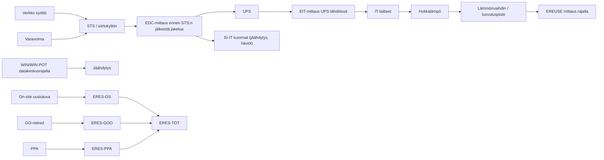
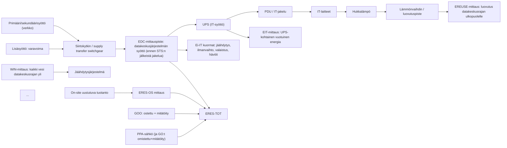
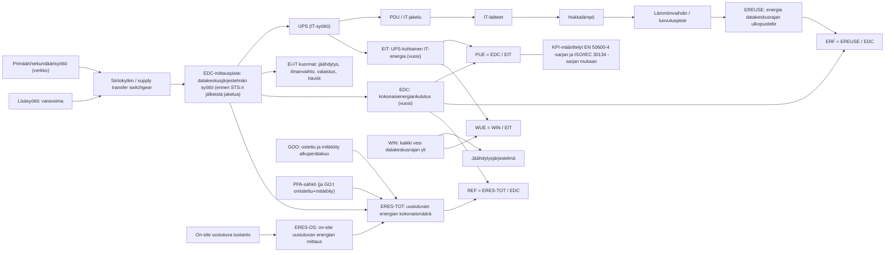

# M – Menetelmäopas (EU-yhteensopiva): konesalin toiminnan optimointi mittausdatan avulla

## Executive summary (tiivistelmä)
Tämä menetelmäopas tekee datakeskuksen (oma DC tai colocation) sähkö–IT–jäähdytys–vesi–uusiutuva–hukkalämpö -ketjun mitattavaksi ja todennettavaksi.
Opas on yhteensopiva EU:n datakeskusraportoinnin ensimmäisen vaiheen kanssa: käytetään EU-muuttujia (EDC, EIT, WIN, WIN-POT, EREUSE, ERES-TOT + alaerät) ja lasketaan EU-ydinindikaattorit PUE/WUE/ERF/REF.

CO2e (Scope 2) käsitellään täydentävänä mittarina (location-based + market-based). CUE ei ole tämän oppaan ydinkori.

Määrittämättä (unspecified): mittarimallit, mittaritoimittaja, DCIM/BMS/EMS-vendorien API:t ja integraatiotekniikat (kuvataan vain vaatimustasolla).

---

## M0. Tarkoitus ja periaate

### M0.1 Soveltamisala (mitä tämä opas kattaa)
Tämä opas koskee datakeskuksen käytönaikaista mittaamista ja optimointia niin, että energiatehokkuus ja kestävyys eivät jää väitteiksi vaan voidaan osoittaa datalla.

EU-compliance huomio:
- Jos datakeskuksen asennettu IT-tehontarve (PDIT) ≥ 500 kW, EU-raportointi on velvoittavaa; muille opas toimii vapaaehtoisena “EU-ready” -mallina.
- Raportointi tehdään EU-tietokantaan vuosittain edeltävästä kalenterivuodesta (komissio: 15.9.2024 ja sen jälkeen 15.5. vuosittain; kansalliset aikataulut voivat tarkentua).

Ketju, jota mitataan ja optimoidaan:
- energia: EDC (kokonaisenergia) ja EIT (IT-energia)
- vesi: WIN (kokonaisvedenotto) ja WIN-POT (talousvesi)
- hukkalämpö: EREUSE (hyötykäyttöön luovutettu lämpö)
- uusiutuva energia: ERES-TOT (GOO + PPA + on-site)
- täydentävä: CO2e (Scope 2), E_cooling, UPS-häviöt, lämpötilat/ΔT, jne.

### M0.2 Toteutusperiaate (mikä on “pakko olla totta”, jotta optimointi on todennettavaa)
Optimointi on todennettavaa vain, jos seuraavat ovat yhtä aikaa totta:

1) Mittausrajat on määritelty (datakeskusraja, energia-/vesiraja, lämpöluovutusraja).
2) EU-ydinmuuttujat mitataan EU-mittauspisteistä:
   - EDC mitataan ennen siirtokytkintä (STS) ja erikseen lisäsyötöissä (esim. varavoima → EDC-BG).
   - EIT mitataan UPS-lähdöissä (vuosisumma kaikista IT-UPS:istä). Jos ei UPS:ää: PDU tai Category 2 / määritelty piste.
   - WIN ja WIN-POT mitataan datakeskusrajalla (WUE-kategoria ilmoitetaan).
   - EREUSE mitataan lämmön luovutuspisteessä datakeskusrajalla.
3) KPI-laskenta on versionhallittua; sama data tuottaa aina saman tuloksen.
4) Mittauspisteistä ja mittalaitteista pidetään mittarirekisteri (säilytys ≥ 10 vuotta).

Suositus mittausepävarmuuden hallintaan:
- pääenergiamittaukset: IEC 62053-22 luokka 0.5S (tai parempi)
- alajakoon: IEC 62053-21 luokka 1 (tai parempi)
- vesimittarit ja lämpöenergiamittarit: käytä paikallisesti varmennettavia/mittalain mukaisia ratkaisuja (tarkat standardit ja mittarimallit: unspecified)

### M0.3 Menetelmän silmukka (mitä tehdään aina samalla tavalla)
Menetelmä on jatkuva silmukka:
**mittaa → analysoi → muuta → todenna → vakioi**

EU-raportointi kytketään silmukkaan näin:
- “mittaa” tuottaa tunti-/15 min-/5 min -aikasarjat
- “vakioi” tuottaa vuositasoisen EU-raportin (kalenterivuosi) ja dokumentoidun audit trailin

---

## M1. Rajaus (mitä mitataan ja mistä vaikutus syntyy)

### M1.1 Operatiivisen mittauksen rajat (käyttövaihe)
Energia (EDC/EIT):
- EDC (kWh) sisältää sähkön lisäksi polttoaineet ja muut jäähdytykseen käytetyt energialähteet. Varavoimaosuus raportoidaan erikseen (EDC-BG).
- EDC mitataan datakeskusjärjestelmän sisääntulossa ennen STS:ää; mittauspisteet primääri-, sekundääri- ja lisäsyötöille (esim. generaattori).
- CHP/absorptiojäähdytin:
  - jos sisäinen: mittaa polttoaine sisäänmenossa (fuel input)
  - jos ulkoinen: CHP: mittaa sähkö- ja lämpöulostulot; absorptio: mittaa jäähdytysulostulo.

IT-energia (EIT):
- EIT (kWh) mitataan PUE Category 1 -menetelmällä UPS-tasolla (kaikkien IT-UPS:ien vuosisumma).
- Jos UPS puuttuu: EIT PDU:ssa tai Category 2 / datakeskuksen määrittelemässä mittauspisteessä.

Vesi (WIN/WIN-POT):
- WIN (m³) mittaa kaikki datakeskusrajan yli tulevat vesimäärät, joita käytetään datakeskustoimintoihin (ympäristö, sähkö, turvallisuus, IT).
- WIN mitataan WUE Category 2 -menetelmällä (tai jos ei mahdollista, Category 1) ja raportoija ilmoittaa käytetyn kategorian.
- WIN-POT (m³) mittaa kaikki talousvesilähteet datakeskusrajan yli (WUE Category 1).
- Sekakäyttörakennuksessa WIN ja WIN-POT rajataan datakeskuksen laitteiden käyttämään (tai perustellusti arvioituun) osuuteen.

Hukkalämpö (EREUSE):
- EREUSE (kWh) sisältää vain datakeskusrajan ulkopuolelle luovutetun lämmön, joka korvaa ulkopuolista energiantarvetta.
- EREUSE mitataan datakeskusrajalla luovutuspisteessä (handover point).
- Jos osa lämmöstä käytetään datakeskuksen jäähdytykseen, se vähennetään EREUSE:sta.

Uusiutuva energia (ERES):
- ERES-TOT (kWh) = ERES-GOO + ERES-PPA + ERES-OS.
- ERES-GOO: ostetut ja mitätöidyt alkuperätakuut (GO) (ei “synny” PPA:sta tai on-site -tuotannosta samaan aikaan).
- ERES-PPA: PPA-sopimuksilla toimitettu energia. Jos PPA tuottaa GO:t, niiden on oltava datakeskuksen omistamia ja mitätöityjä; muuten vähennä kyseinen energia ERES-PPA:sta.
- ERES-OS: datakeskusrajalla tuotettu on-site uusiutuva energia. Jos tuotannosta syntyy GO, se on omistettava ja mitätöitävä; muuten vähennä ERES-OS:sta.
- Tuplalaskenta ei ole sallittua: sama energiamäärä ei voi kuulua usealle datakeskukselle.

### M1.2 Pakolliset KPI:t (EU-ydinkori) ja täydentävät mittarit
EU-ydinkori (raportointikelpoinen):
- PUE = EDC / EIT
- WUE = WIN / EIT (EIT MWh-yksikössä)
- ERF = EREUSE / EDC
- REF = ERES-TOT / EDC

Täydentävät (optimointia varten, ei EU-ydinkori):
- CO2e_total (Scope 2): EDC_electricity × EF (location-based ja market-based raportoidaan erikseen)
- E_cooling, UPS-häviöt, lämpötilat/ΔT, verkon sähkö (jos eroteltavissa), jne.

Suositus: Älä käytä CUE:ta ydinkorissa. Jos raportoit CUE:n, tee se täydentävänä ja kerro selvästi päästökertoimien lähde ja menetelmä.

---

## M2. Vaaditut dokumentit (todisteaineisto)

### M2.1 Pakolliset dokumentit (minimi, “pakko olla olemassa”)
1. Mittausrajaus (Measurement Boundary Statement)
   - datakeskusraja: mitä sisältyy EDC/WIN/EREUSE/ERES-OS -rajoihin, mitä rajataan pois
2. Mittauspistekartta (Instrumentation & Metering Map)
   - EDC ennen STS; EIT UPS-lähdöt (tai PDU); WIN/WIN-POT rajalla; EREUSE luovutuspisteessä; EDC-BG erikseen
3. Mittarirekisteri (Meter register) + säilytys
   - mittauspisteet ja mittalaitteet, tunnisteet, sijoitus, mittausväli, tarkkuusluokka, CT:t, kalibrointi/varmennus
   - säilytysaika: vähintään 10 vuotta
4. KPI-sanasto ja laskentasäännöt (KPI Dictionary & Calculation Rules)
   - PUE/WUE/ERF/REF ja yksiköt, aikajänne (kalenterivuosi), rounding, poikkeamat, versionumero
5. Uusiutuvan energian todentaminen (ERES evidence pack)
   - GOO: ostot + mitätöinnit (retired)
   - PPA: toimitusraportti + GO-omistus/mitätöinti tai vähennys
   - on-site: tuotantomittaus + GO-omistus/mitätöinti tai vähennys
6. Datan omistajuus ja toimitusmuoto (Data Access & Delivery Spec)
   - PDF + CSV/JSON + aikavyöhyke + granulariteetti + data quality -kentät
7. Mittauksen käyttöönotto- ja todennuspöytäkirja (Measurement SAT / Commissioning Record)
   - end-to-end: mittari → data → KPI

SAT-checklist (minimi):
- CT-suunta/polaarisuus ja mittauspisteiden vastaavuus (EDC vs syötöt, EIT vs UPS)
- aikaleimat (NTP/PTP), aikavyöhyke, vuosisummaa vastaavat integraatiot
- varavoiman erottelu: EDC-BG erikseen (STS-tila + generaattorimittaus)
- vesimittareiden pulssit/telemetria ja yksikkömuunnokset
- lämpöenergiamittauksen luovutuspiste ja “sisäinen jäähdytyskäyttö vähennetään” -logiikka

### M2.2 Suositeltavat dokumentit (nostaa Standard/Advanced-tasolle)
- Sähkön single-line diagram + häviöallokointi (muuntajat–STS–UPS–jakelu)
- Jäähdytysjärjestelmän prosessikaaviot + ohjausperiaatteet (setpointit, free-cooling)
- Lämpöluovutuksen rajapintasopimus (handover: mittausvastuut, lämpötaso, mittari)
- Veden käyttöpolku (mistä vesi tulee, mihin se menee, mahdolliset kierrätykset)
- Datan laadun valvontamalli (quality flags, missing%, drift, freeze)

### M2.3 Roolipohjainen ohje (“teen itse vai saan jostain?”)
- Colocation-asiakas: vaadi operaattorilta dokumentit 1–7 sopimusliitteeksi (“EU-ready Sustainability Data Pack”).
- DC-omistaja/rakentaja: vaadi mittausvaraukset suunnitteluun ja SAT käyttöönottoon urakkaan.
- IT-palveluomistaja: tuo kuormapolitiikat/SLA ja sovellusmittarit “muutos → vaikutus” -todennukseen.

---

## M3. Minimitasot (EU-Compliance / Basic / Standard / Advanced)

### EU-Compliance (vuosiraportointi EU-kehikkoon)
- Vuositasoinen (kalenterivuosi) EDC/EIT/WIN/WIN-POT/EREUSE/ERES-TOT (+ alaerät) ja johdetut PUE/WUE/ERF/REF.
- Mittarirekisteri (≥10 v), mittausrajat ja laskentasäännöt versionhallittuna.

### Basic (audit-kelpoinen kuukausiseuranta + vuosiraporttivalmius)
Mittauspaketti:
- EDC, EIT, WIN, WIN-POT, (jos käytössä) EREUSE, ERES-TOT (vähintään summa)
Granulariteetti:
- suositus ≥ 60 min aikasarja; EU-raporttiin agregoidaan vuositasolle
Tuotos:
- PUE/WUE/ERF/REF vuositasolla + kuukausitrendit; CO2e (Scope 2) täydentävänä

### Standard (ohjaukseen ja “muutos → vaikutus” -todennukseen)
Lisäksi:
- E_cooling eritelty + UPS_in/UPS_out (häviöt) + lämpötila/ΔT
Granulariteetti:
- suositus 15 min
Tuotos:
- PUE + jäähdytysosuus + UPS-häviöt; ERF/REF seuranta; poikkeamahavainnointi

### Advanced (jatkuva optimointi ja automaatio/AI)
Lisäksi:
- vyöhykemittaukset (sähkö + jäähdytys), lämpöluovutuksen reaaliaikainen mittaus, data quality -indikaattorit, (opt.) verkon energiadata
Granulariteetti:
- suositus 5 min (tai tiheämpi)
Mahdollistaa:
- kuorman ja jäähdytyksen yhteisoptimoinnin, automaattisen anomalioiden havainnoinnin ja mallipohjaisen ohjauksen

---

## M4. Todennukset (audit-kelpoisuus)

### M4.1 Mittauksen todennus (pakollinen ennen optimointia)
End-to-end SAT (“mittari → data → KPI”):
- EDC mitataan ennen STS:ää ja syötöt täsmäävät; EDC-BG eroteltavissa
- EIT on UPS-summa (tai PDU/Category 2 perusteltu)
- WIN/WIN-POT rajalla ja WUE-kategoria kirjattu
- EREUSE luovutuspisteessä ja “sisäinen jäähdytyskäyttö vähennetään” -ehto toteutuu
Deliverable:
- SAT-pöytäkirja + poikkeamat + korjaustoimet

### M4.2 Datan laadun todennus (jatkuva)
- katkokset, drift, jäätyneet arvot, epärealistiset hyppäykset
- quality_flag (OK/ESTIMATED/MISSING/CHANGED_POINT) + estimation_note
- KPI-sääntöjen muutosloki (versiointi)

### M4.3 Optimoinnin todennus (“ennen–jälkeen”, aina)
Jokaiselle muutokselle:
- baseline-jakso + muutosikkuna + vaikutus (PUE/WUE/ERF/REF ja täydentävät)
- normalisointi: kuorma, ulkolämpötila (CDD), käyttöaste
- hyväksyntä vasta, kun vaikutus on mitattu eikä oletettu

---

## M5. Mittausdata → CO2e (täydentävä)

### M5.1 Scope 2 -peruslaskenta (dual reporting)
- CO2e_location = sähkönkulutus × location-based EF
- CO2e_market = sähkönkulutus × market-based EF (sopimusinstrumentit)
- Raportoi molemmat, jos markkina-instrumentteja on käytössä (GHG Protocol Scope 2 Guidance).

Huom:
- CO2e sidotaan ensisijaisesti sähkönkulutukseen; EDC sisältää myös polttoaineita → Scope 1 erillisenä, jos todennettavissa (unspecified: tarkka Scope 1 -malli).

### M5.2 Hukkalämmön mittaus (EREUSE) ja tulkinta
- EREUSE raportoidaan mitattuna energiana (kWh) luovutuspisteestä.
- Älä vähennä CO2e:ta “automaattisesti” EREUSE:n perusteella ilman erillistä, auditoitavaa korvausenergian metodologiamäärittelyä.

---

## M6. Optimointimenetelmä (mistä vaikutus syntyy)

### M6.1 IT-kuorman optimointi (energia per palvelu)
- konsolidointi, right-sizing, idle-energian leikkaus
Todennus:
- EIT laskee tai palveluyksikkö/energia paranee ilman SLA-heikennystä

### M6.2 Verkon optimointi (liikenne per energia)
- jos verkon energia eroteltavissa, optimoi laite- ja linkkikäyttö kuorman mukaan
Todennus:
- verkon kWh laskee tai kWh/GB paranee, latenssi ja häiriöt hallinnassa

### M6.3 Jäähdytyksen optimointi (lämmön poisto pienemmällä energialla)
- setpointit, containment, free-cooling, pumppu- ja puhallinohjaukset
Todennus:
- E_cooling laskee, hotspotit eivät kasva, PUE/WUE paranee

### M6.4 Hukkalämmön hyötykäyttö (ERF)
- vakioi lämpöteho ja lämpötaso vastaanottajalle; mittaa EREUSE luotettavasti
Todennus:
- EREUSE kasvaa/vakaantuu (mitattu) ja ERF paranee

### M6.5 AI/DA-ohjaus (toteutus niin, että vaikutus voidaan todentaa)
Syöte (Standard/Advanced):
- EDC/EIT/E_cooling/UPS_in-out, lämpötila/ΔT, CDD, kuormaprofiili, data quality -flagit

Ohjausmuuttujat:
- jäähdytyksen setpointit, pumppu-/puhallinohjaukset, free-cooling-tilat
- IT-kuorman sijoittelu (SLA-rajoissa)

Rajoitteet:
- SLA/viive/kapasiteettirajat, lämpötila/hotspot-rajat, redundanssi ja sähköketjun turvarajat

Todennus:
- malliversiointi + muutosloki + “ennen–jälkeen” -raportti KPI-vaikutuksineen

---

## M7. Mitä asiakkaana saat ulos (“Sustainability Data Pack”)

### M7.1 Pakollinen raportti (kuukausi + vuositiivistelmä)
Sisältö vähintään:
- EDC, EIT, WIN, WIN-POT, EREUSE (jos käytössä), ERES-TOT (+ alaerät jos saatavilla)
- PUE, WUE, ERF, REF
Täydentävä:
- CO2e (Scope 2 location + market) + EF-lähde ja päivitysrytmi
Liitteet (audit-kelpoisuus):
- mittausrajat + mittauspistekartta (versio)
- mittarirekisteri (versio) + SAT-pöytäkirja
- KPI-säännöt (versio) + data quality -yhteenveto

### M7.2 Koneellinen toimitus (CSV/JSON/API) – minimikentät
Minimi:
- aikaleima + aikavyöhyke + granulariteetti + quality_flag
- raw: edc_kwh, eit_kwh, win_m3, win_pot_m3, ereuse_kwh, eres_tot_kwh, eres_goo_kwh, eres_ppa_kwh, eres_os_kwh
- derived: pue, wue_m3_per_mwh, erf, ref
- optional: co2e_location_kg, co2e_market_kg, ef_source

Esimerkki (CSV, vuosirivi):
reporting_year,dc_id,edc_kwh,eit_kwh,win_m3,win_pot_m3,ereuse_kwh,eres_tot_kwh,eres_goo_kwh,eres_ppa_kwh,eres_os_kwh,pue,wue_m3_per_mwh,erf,ref,quality_flag,estimation_note

Esimerkki (JSON):
{
  "reporting_year": 2025,
  "dc_id": "FI-DC-001",
  "timezone": "Europe/Helsinki",
  "raw": {
    "EDC_kWh": 10000000,
    "EIT_kWh": 8000000,
    "WIN_m3": 12000,
    "WIN_POT_m3": 3000,
    "EREUSE_kWh": 1500000,
    "ERES": {
      "TOT_kWh": 6000000,
      "GOO_kWh": 2000000,
      "PPA_kWh": 3000000,
      "OS_kWh": 1000000
    }
  },
  "derived": { "PUE": 1.25, "WUE_m3_per_MWh": 1.5, "ERF": 0.15, "REF": 0.60 },
  "data_quality": { "quality_flag": "OK", "estimation_note": "" },
  "unspecified": { "meter_models": true, "vendor_apis": true }
}

### M7.3 Todisteet asiakkaalle (mitä voit pyytää)
- mittausrajat + mittauspistekartta + mittarirekisteri (≥10 v)
- SAT/commissioning record
- GO-omistus ja mitätöinti (retired), PPA‑todenteet, on-site -tuotannon mittaus
- data quality -raportti ja KPI-sääntöjen muutosloki

---

## Taulukot

### Raakamuuttujat (EU-ydin)
| Muuttuja | Yksikkö | Mitä sisältää | Pakollinen mittauskohta |
|---|---:|---|---|
| EDC | kWh | Sähkö + polttoaineet + muut jäähdytyksen energialähteet | ennen STS, kaikki syötöt |
| EDC-BG | kWh | varavoimasta tullut EDC-osuus | erikseen varavoimalähteestä |
| EIT | kWh | IT-kuorman energia | UPS-lähdöt (jos ei UPS:ää: PDU/Category2/määritelty) |
| WIN | m³ | kaikki vesi datakeskusrajalla (DC-toiminnot) | datakeskusraja, WUE Cat2 (tai Cat1) |
| WIN-POT | m³ | talousvesi datakeskusrajalla | datakeskusraja, WUE Cat1 |
| EREUSE | kWh | ulos toimitettu hyödynnetty lämpö (korvaa ulkoista energiaa) | luovutuspiste datakeskusrajalla |
| ERES-TOT | kWh | uusiutuva energia yhteensä | ERES-GOO + ERES-PPA + ERES-OS |
| ERES-GOO | kWh | ostetut ja mitätöidyt GO:t | GO-retirement todenteet |
| ERES-PPA | kWh | PPA-energia (ei tuplalaskentaa) | PPA-todenteet + GO-omistus/retirement tai vähennys |
| ERES-OS | kWh | on-site tuotanto datakeskusrajalla | tuotantomittaus + GO-omistus/retirement tai vähennys |

### Mittauspisteet ja menetelmät (tiivis)
| Suure | Mittauspiste | Menetelmä | Huomio |
|---|---|---|---|
| EDC | input ennen STS | energiamittaus syötössä | syötöt: primääri/sekundääri/lisäsyötöt |
| EIT | UPS-lähdöt | UPS-kohtainen vuosisumma | jos ei UPS:ää: PDU/Category2/määritelty piste |
| WIN | vesiraja | WUE Cat2 (tai Cat1) | mittaa kaikki DC-toimintoihin liittyvä vesi |
| WIN-POT | vesiraja | WUE Cat1 | talousvesi erikseen |
| EREUSE | lämmön luovutuspiste | lämpöenergiamittaus | vähennä sisäinen jäähdytyskäyttö |
| ERES-* | rajalla + todenteet | EN 50600-4-3 tai vastaava | GO/PPA/OS-tuplalaskenta estettävä |

---

## Mermaid-kaaviot

### Mittauspisteiden suhteet

Käyttöönoton aikajana
gantt
  title EU-ready mittausketjun käyttöönotto (esimerkki)
  dateFormat  YYYY-MM-DD
  section Suunnittelu
  Mittausrajat ja mittauspistekartta :a1, 2026-03-15, 21d
  Mittarivarausten suunnittelu (EDC/EIT/WIN/EREUSE/ERES) :a2, after a1, 21d
  section Toteutus
  Mittareiden asennus ja rekisteröinti :b1, after a2, 30d
  Datan keruu ja tallennus (EMS/DCIM) :b2, after b1, 30d
  section Commissioning
  SAT: mittari→data→KPI :c1, after b2, 14d
  Data quality -hälytykset ja korjaukset :c2, after c1, 21d
  section Raportointi
  Vuosiraportin ETL + validointi :d1, after c2, 14d
  Data Pack + sisäinen hyväksyntä :d2, after d1, 14d

